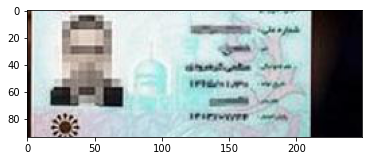
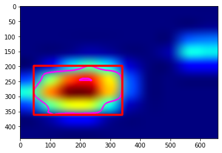

# Object Identification and Localization Using Grad-CAM

## Introduction
What makes the network think the image should belong to a specific class? 
Grad-cam is a method for producing heatmaps that is applied to an already-trained neural network after training is complete and the parameters are fixed.
In this project, Grad-CAM is used to weakly localize ID cards and looking for the ROI in input images.

## Steps
In order to use class activation map, first, a pre-trained CNN is used to classify images that have ID cards. after that, the class activation map is computed for the last convolutional layer of the CNN.
it should result in something like this: 

The next step is to interpolate the class activation map image to become the same size as the original image.

Then the class activation map is converted to a binary image to find contour.

Finally, a bounding box is drawn around the found contour. if there are multiple id cards in the input image, all of them will be localized.

#### More Visual Examples obtained by Xception trained on imagenet dataset:
|  Image | GradCAM  | Binarized GradCam  | Interpolated GradCam | Localized Object |
| -------|----------|------------|------------|------------|
|   |      |      |    |    |
|   |      |      |    |    |
|   |      |      |     |     |
|   |      |      |     |  |

This is the first phase of my final project of Deep Learning course taught by Dr.Mohammadi at IUST.

## Ref

[Grad-CAM class activation visualization](https://keras.io/examples/vision/grad_cam/)
